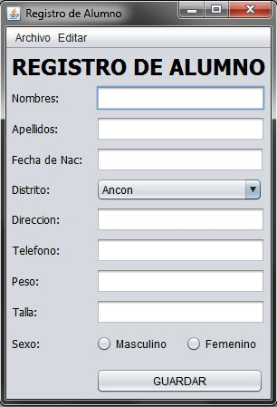

# GESTOR DE PERSONAS

## De que trata la aplicacion: 
La aplicacion se encarga de llevar un **control** de las *personas* que se registran y utilizan el sistema.

## Tecnologias utilizadas

*Java
*HTML
*CSS

## Insatalacion

Es necesario tener Java 17 instalado aqui tienes el enlace a la descarga
[JAVA 17](https://www.oracle.com/java/technologies/javase/jdk17-archive-downloads.html)

1. Clona el repositorio de GitHub.
   'git clone https://github.com/MiguelGram/gestor-personas.git'
3. Entra en el directorio del proyecto.
   'cd gestor-personas'
5. Instala las dependencias.
   'npm install'
7. Y listo para Ejecutar.
   'npm start'

   ## Asi tendria que verse

| Programadores | Fecha |
| ----------- | ----------- |
| Miguel | 2025-2026 |
| Rober | 2025-2025 | 

## Aqui te dejo otro proyecto
[Gestion de empresas]/(https://github.com/MiguelGram/AprendiendoMuchoGit)
